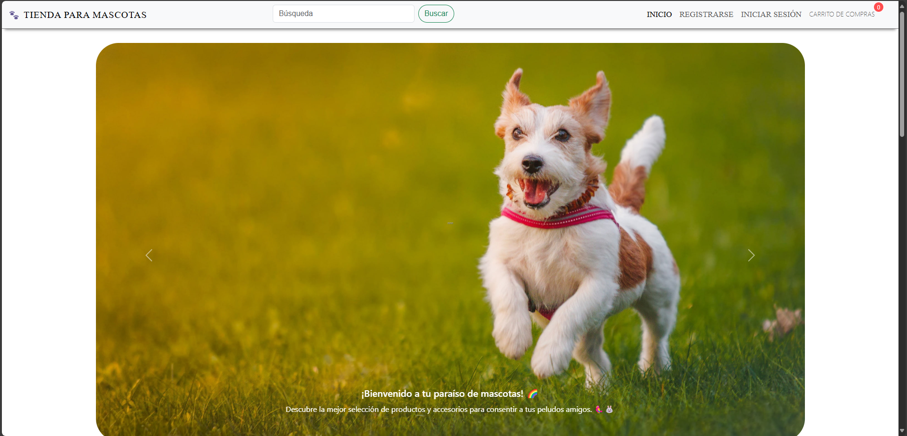
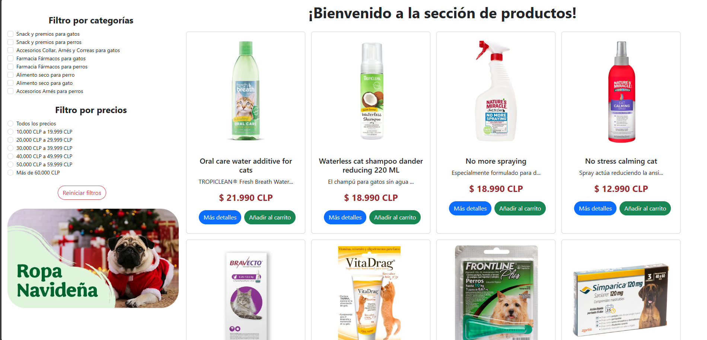
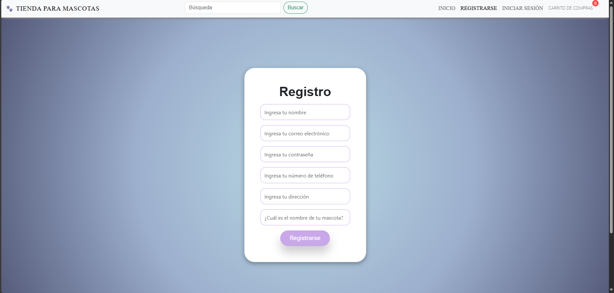
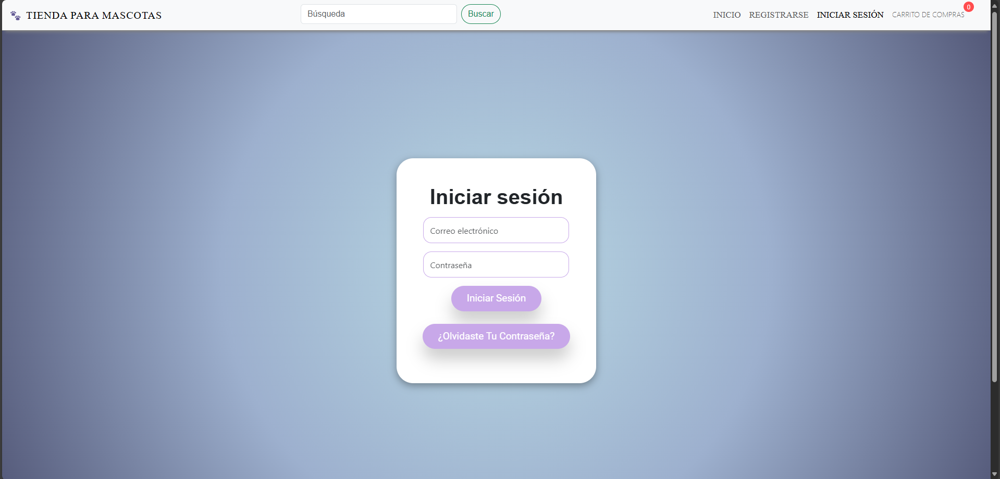
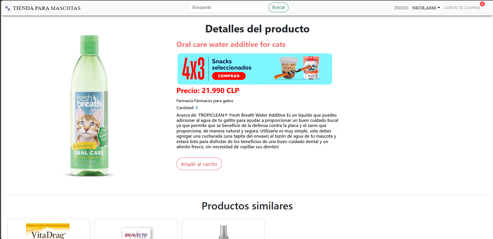
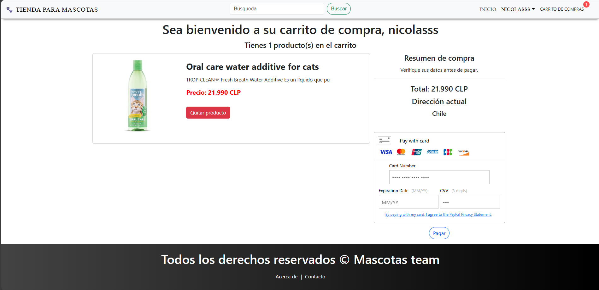
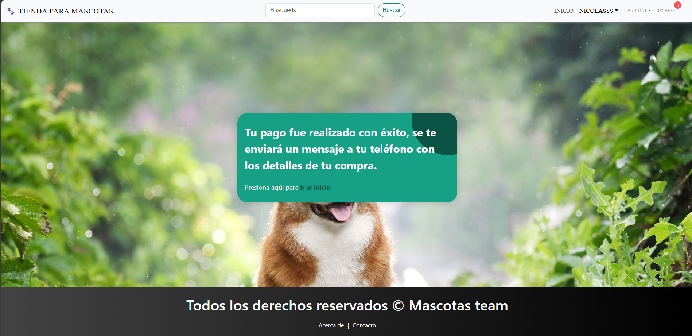

<h1 align="center">Ecommerce de Productos para Mascotas</h1>

  

    
  

Esta aplicación web fue creada con el objetivo de ayudar a las tiendas de barrio que venden productos para mascotas a expandirse y llegar a más clientes. Con este ecommerce, buscamos ofrecer a los pequeños comerciantes una plataforma accesible donde puedan exhibir la diversidad de productos que tienen para ofrecer, facilitando que los dueños de mascotas encuentren todo lo que necesitan desde la comodidad de sus hogares.

La aplicación está construida utilizando el stack **MERN** (MongoDB, Express, React, Node.js), lo que permite una experiencia rápida y dinámica tanto para los usuarios como para los administradores. En la plataforma, los usuarios pueden explorar una variedad de productos, filtrarlos según sus necesidades, y agregar los artículos deseados a su carrito de compras de manera fácil y eficiente.

Para mejorar la seguridad, los usuarios tienen la opción de crear una cuenta y protegerla con una pregunta de seguridad adicional. Una vez que hayan seleccionado sus productos, podrán realizar pagos seguros a través de la pasarela **PayPal Braintree**, que acepta diferentes tipos de tarjetas de crédito y débito.

Además, la aplicación cuenta con un completo panel de administrador, desde el cual los dueños de las tiendas pueden gestionar su catálogo de productos. Esto incluye la capacidad de agregar nuevos productos, actualizar la información existente y eliminar artículos que ya no están disponibles.

<h1 align="center">Módulos de la Aplicación</h1>

- **Módulo de Registro y Autenticación:** Permite a los usuarios crear y proteger su cuenta con seguridad adicional.
- **Módulo de Gestión de Productos (Admin):** Los administradores pueden añadir, editar y eliminar productos en la tienda.
- **Módulo de Filtrado de Productos:** Los usuarios pueden buscar y filtrar productos según diferentes categorías y necesidades.
- **Módulo de Carrito de Compras:** Los usuarios pueden agregar productos a su carrito y gestionarlo antes de proceder con la compra.
- **Módulo de Pasarela de Pagos:** Utiliza PayPal Braintree para procesar pagos de manera segura y eficiente.
- **Módulo de Seguridad con Pregunta Secreta:** Refuerza la seguridad de la cuenta del usuario mediante preguntas de seguridad adicionales.
- **Módulo de Gestión de Pedidos:** Los usuarios pueden revisar y gestionar sus pedidos una vez completados.

<h1 align="center">Imágenes de demostración</h1>

  
  
  
  
  
  
  

